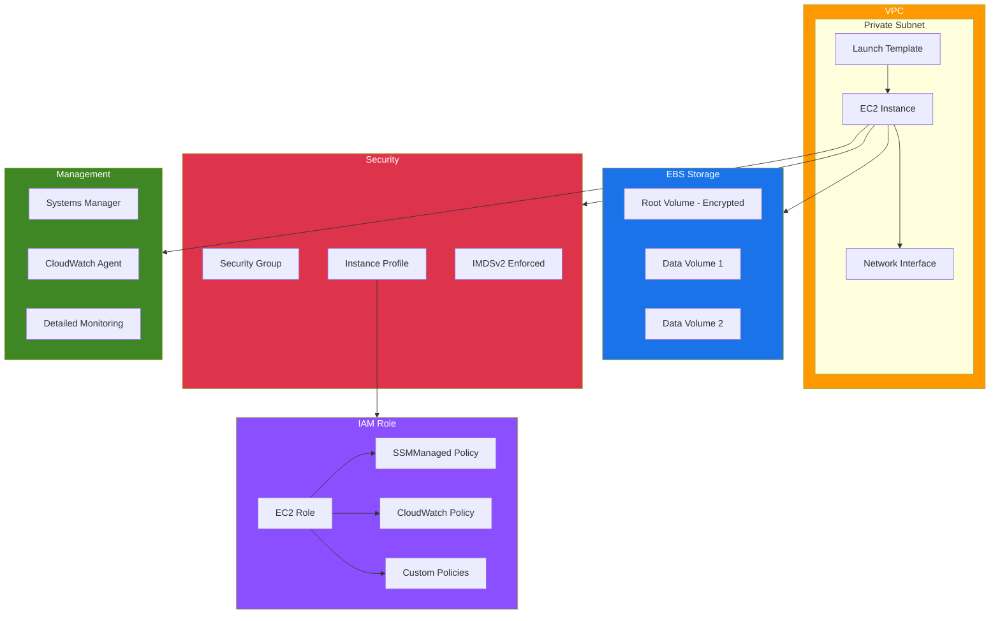

# terraform-aws-ec2-instance

Production-ready Terraform module for provisioning AWS EC2 instances with launch templates, instance profiles, EBS optimization, IMDSv2 enforcement, and SSM access.

## Architecture



## Features

- **Launch Templates** - All instances are created via launch templates for consistent, versioned configurations
- **IMDSv2 Enforcement** - Instance Metadata Service v2 required by default for enhanced security
- **IAM Instance Profiles** - Automatic creation of IAM roles and instance profiles with SSM and CloudWatch policies
- **EBS Optimization** - EBS-optimized instances with encrypted volumes by default
- **Security Groups** - Optional security group creation with configurable ingress rules
- **Additional EBS Volumes** - Support for multiple additional EBS volumes with independent configurations
- **SSM Access** - Systems Manager access enabled by default for secure, keyless instance management
- **Spot Instances** - Sub-module for spot instance provisioning with configurable interruption behavior

## Usage

### Minimal Configuration

```hcl
module "ec2_instance" {
  source  = "kogunlowo123/ec2-instance/aws"

  name      = "my-instance"
  subnet_id = "subnet-abc123"
  vpc_id    = "vpc-abc123"
}
```

### Production Configuration

```hcl
module "ec2_instance" {
  source  = "kogunlowo123/ec2-instance/aws"

  name          = "production-app"
  ami_id        = "ami-0123456789abcdef0"
  instance_type = "m6i.xlarge"
  subnet_id     = "subnet-abc123"
  vpc_id        = "vpc-abc123"
  key_name      = "my-key-pair"

  # EBS configuration
  root_block_device = {
    volume_type = "gp3"
    volume_size = 100
    iops        = 3000
    throughput  = 250
    encrypted   = true
  }

  additional_ebs_volumes = [
    {
      device_name = "/dev/xvdb"
      volume_type = "gp3"
      volume_size = 500
      encrypted   = true
    }
  ]

  # Security
  metadata_http_tokens = "required"
  metadata_hop_limit   = 2
  enable_ssm           = true

  # Networking
  create_security_group = true
  ingress_rules = [
    {
      description = "HTTPS"
      from_port   = 443
      to_port     = 443
      protocol    = "tcp"
      cidr_blocks = ["10.0.0.0/8"]
    }
  ]

  # IAM
  create_iam_instance_profile = true
  iam_policies = [
    "arn:aws:iam::aws:policy/AmazonS3ReadOnlyAccess",
  ]

  tags = {
    Environment = "production"
    Team        = "platform"
  }
}
```

### Spot Instances

```hcl
module "spot_instance" {
  source = "kogunlowo123/ec2-instance/aws//modules/spot"

  name          = "batch-worker"
  ami_id        = "ami-0123456789abcdef0"
  instance_type = "m6i.large"
  subnet_id     = "subnet-abc123"
  vpc_id        = "vpc-abc123"

  security_group_ids = ["sg-abc123"]
  spot_type          = "one-time"

  tags = {
    Environment = "production"
  }
}
```

## Requirements

| Name | Version |
|------|---------|
| terraform | >= 1.3.0 |
| aws | >= 5.0, < 6.0 |

## Providers

| Name | Version |
|------|---------|
| aws | >= 5.0, < 6.0 |

## Resources

| Name | Type |
|------|------|
| aws_instance.this | resource |
| aws_launch_template.this | resource |
| aws_ebs_volume.this | resource |
| aws_volume_attachment.this | resource |
| aws_security_group.this | resource |
| aws_security_group_rule.ingress | resource |
| aws_security_group_rule.egress | resource |
| aws_network_interface.this | resource |
| aws_iam_role.this | resource |
| aws_iam_instance_profile.this | resource |
| aws_iam_role_policy_attachment.ssm | resource |
| aws_iam_role_policy_attachment.cloudwatch | resource |
| aws_iam_role_policy_attachment.additional | resource |

## Inputs

| Name | Description | Type | Default | Required |
|------|-------------|------|---------|----------|
| name | Name identifier for all resources | `string` | - | yes |
| ami_id | AMI ID (defaults to latest Amazon Linux 2023) | `string` | `""` | no |
| instance_type | EC2 instance type | `string` | `"t3.micro"` | no |
| subnet_id | VPC subnet ID | `string` | - | yes |
| vpc_id | VPC ID | `string` | - | yes |
| key_name | Key pair name | `string` | `null` | no |
| user_data | User data script | `string` | `null` | no |
| user_data_base64 | Base64-encoded user data | `string` | `null` | no |
| enable_monitoring | Enable detailed monitoring | `bool` | `true` | no |
| ebs_optimized | Enable EBS optimization | `bool` | `true` | no |
| iam_instance_profile_name | Existing instance profile name | `string` | `null` | no |
| create_iam_instance_profile | Create IAM instance profile | `bool` | `true` | no |
| iam_policies | Additional IAM policy ARNs | `list(string)` | `[]` | no |
| root_block_device | Root volume configuration | `object` | See variables.tf | no |
| additional_ebs_volumes | Additional EBS volumes | `list(object)` | `[]` | no |
| security_group_ids | Existing security group IDs | `list(string)` | `[]` | no |
| create_security_group | Create a security group | `bool` | `true` | no |
| ingress_rules | Security group ingress rules | `list(object)` | `[]` | no |
| associate_public_ip | Associate public IP | `bool` | `false` | no |
| metadata_http_tokens | IMDSv2 token requirement | `string` | `"required"` | no |
| metadata_hop_limit | Metadata hop limit | `number` | `1` | no |
| enable_ssm | Attach SSM policy | `bool` | `true` | no |
| private_ip | Private IP address | `string` | `null` | no |
| availability_zone | Availability zone | `string` | `null` | no |
| placement_group | Placement group | `string` | `null` | no |
| tenancy | Instance tenancy | `string` | `"default"` | no |
| tags | Resource tags | `map(string)` | `{}` | no |

## Outputs

| Name | Description |
|------|-------------|
| instance_id | The ID of the EC2 instance |
| private_ip | The private IP address of the instance |
| public_ip | The public IP address of the instance |
| security_group_id | The ID of the created security group |
| iam_role_arn | The ARN of the IAM role |
| iam_role_name | The name of the IAM role |
| iam_instance_profile_name | The name of the instance profile |
| launch_template_id | The ID of the launch template |
| launch_template_latest_version | The latest version of the launch template |

## Sub-Modules

| Module | Description |
|--------|-------------|
| [spot](./modules/spot/) | Spot instance provisioning with configurable spot options |

## Examples

| Example | Description |
|---------|-------------|
| [basic](./examples/basic/) | Minimal instance with defaults |
| [advanced](./examples/advanced/) | Custom AMI, multiple EBS volumes, security rules, IAM policies |
| [complete](./examples/complete/) | Full production setup with on-demand and spot instances, KMS encryption |

## Security Best Practices

This module enforces several security best practices by default:

1. **IMDSv2 Required** - Prevents SSRF attacks via instance metadata
2. **EBS Encryption** - Root and additional volumes encrypted by default
3. **No Public IP** - Instances are private by default
4. **SSM Access** - Enables keyless SSH via AWS Systems Manager
5. **Least Privilege IAM** - Role-based access with only necessary permissions
6. **Security Group Egress** - Controlled egress rules

## License

MIT Licensed. See [LICENSE](LICENSE) for full details.
